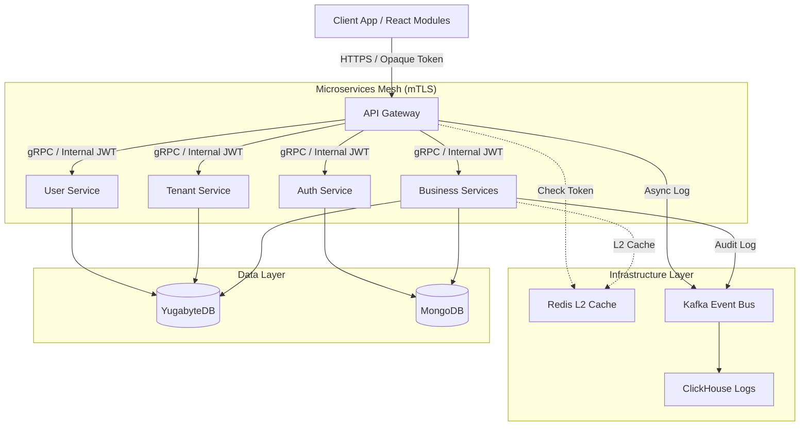
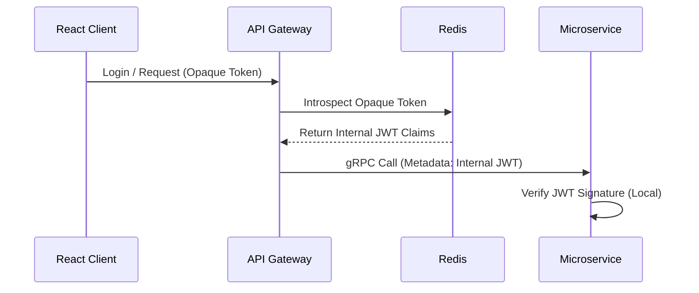

# Architecture Documentation

Technical architecture and design documentation for the **High-Performance Go Microservices Framework**.

## 📊 Visual Diagrams

- **[System Architecture](#system-architecture)** - Polyglot persistence & Microservices
- **[Auth Flow](#authentication--security)** - Phantom Token & Token Exchange
- **[Data Flow](#logging--observability)** - gRPC, Kafka & CDC

## Table of Contents

- [Overview](#overview)
- [Tech Stack](#tech-stack)
- [System Architecture](#system-architecture)
- [Design Philosophy](#design-philosophy)
- [Database Standards (Cheatsheet)](#database-standards-cheatsheet)
- [Detailed Service Architecture](#detailed-service-architecture)
- [Authentication & Security](#authentication--security)
- [Caching Strategy (3-Level)](#caching-strategy-3-level)
- [Logging & Observability](#logging--observability)
- [Frontend Identity & Authorization](#frontend-identity--authorization-utilities)
- [Development Workflow (Zero-Config)](#development-workflow-zero-config)
- [Critical Implementation Notes](#critical-implementation-notes)

---

## Overview

This framework is designed for **High-Performance, Scalability, and Multi-tenancy**. It moves away from a monolithic database approach to a **Polyglot Persistence** architecture, using specific databases for specific types of data. It employs **gRPC** for internal communication, **Kafka** for event-driven consistency, and a **Broker-based Authentication** system.

### Core Principles

1.  **Polyglot Persistence:** Use the right DB for the right job (SQL for ACID, NoSQL for Flex, OLAP for Logs).
2.  **Clean Architecture:** Strict separation of Transport, Service, and Repository layers.
3.  **Security First:** mTLS between services, Phantom Token pattern for clients.
4.  **Performance:** 3-Level Caching (React + Local + Redis) and gRPC binary protocol.
5.  **Zero-Config Dev:** Developers connect to shared infrastructure for immediate coding.

---

## Tech Stack

| Component | Technology | Purpose |
| :--- | :--- | :--- |
| **Language** | Go 1.22+ | Backend Services |
| **Communication** | gRPC / gRPC-Gateway | Internal (High perf) / External (REST) |
| **ACID DB** | **YugabyteDB** (PostgreSQL) | Critical Data (Users, Billing, Transactions) |
| **Flex DB** | **MongoDB** | Dynamic Data (Tenant Configs, Catalogs) |
| **Analytics DB** | **ClickHouse** | Audit Logs, Access Logs, Reports |
| **Caching** | **Redis / Dragonfly** | L2 Cache, Pub/Sub, Token Store |
| **Local Cache** | Ristretto / Go-cache | L1 In-memory Cache |
| **Messaging** | **Kafka** | Event Bus, CDC (Change Data Capture) |
| **CDC Tool** | **Debezium** | Outbox Pattern Implementation |
| **Observability** | OpenTelemetry | Tracing & Metrics |
| **Frontend** | React (NextJS) | Schema-driven UI with Zustand/Shared SDK |

---

## System Architecture



## Design Philosophy

### 1\. Polyglot Persistence Strategy

We do not force all data into one database.

* **YugabyteDB:** For entities requiring transactions, relations, and strict schema (e.g., `orders`, `invoices`).
* **MongoDB:** For entities requiring schema flexibility or deeply nested documents (e.g., `product_attributes`, `tenant_app_configs`).
* **ClickHouse:** For immutable, high-volume write data (e.g., `logs`, `traces`, `activity_history`).

### 2\. Separation of Concerns \(Clean Architecture\)

Every microservice must follow this folder structure:

```
internal/
├── api/            # gRPC & HTTP Handlers (Transport)
├── service/        # Business Logic (Pure Go, no DB imports)
├── repository/     # Data Access (Yugabyte/Mongo implementations)
├── model/          # Domain Entities
└── platform/       # Shared Lib (Logging, Config, Cache)
```

### 3\. Shared Library \(`go-shared`)

To maintain consistency, all services import `go-shared` for:

* **Middleware:** Auth interceptors, Logging, Tracing.
* **Connectors:** Standardized wrappers for Yugabyte (`pgx`), Redis, Kafka.
* **Utils:** UUID v7 generator, Error handling, encryption.

***

## Database Standards (Cheatsheet)

Strict rules to ensure consistency across Polyglot Databases.

### A. Naming Conventions

* **Snake Case (`snake_case`):** ALL Tables, Columns, Indexes.
* **Primary Key:** Always named `_id`. Type: `UUID` (String format).
* **Foreign Key:** `singular_entity_id` (e.g., `tenant_id`, `user_id`).
* **Plural Tables:** `users`, `tenants`, `orders`.

### B. Standard Mixins (Mandatory Fields)

SQL

```
_id          UUID PRIMARY KEY,
tenant_id    UUID NOT NULL,       -- Multi-tenancy isolation
is_system    BOOLEAN DEFAULT FALSE,
created_at   TIMESTAMPTZ DEFAULT NOW(),
updated_at   TIMESTAMPTZ DEFAULT NOW(),
created_by   UUID,
updated_by   UUID,
deleted_at   TIMESTAMPTZ NULL,    -- Soft Delete
version      BIGINT DEFAULT 1     -- Optimistic Locking
```

### C. Data Type Mapping

| **Data Type** | **Go** | **YugabyteDB** | **MongoDB** | **ClickHouse** |
| --------- | --- | ---------- | ------- | ---------- |
| **ID** | `string` | `UUID` | `String` | `UUID` |
| **Money** | `decimal.Decimal` | `NUMERIC(19,4)` | `Decimal128` | `Decimal128(4)` |
| **Time** | `time.Time` | `TIMESTAMPTZ` | `Date` | `DateTime64(3)` |
| **JSON** | `struct/map` | `JSONB` | `Object` | `String` |

***

## Detailed Service Architecture

### 1\. API Gateway \(The Entry Point\)

* **Role:** Route traffic, Enforce Security, Protocol Conversion, Multi-tenant Routing.
* **Tech:** Custom Go Service (using `grpc-gateway` + Gin framework).
* **Middleware Pipeline:**
    1. **Trace ID:** Generate/Propagate Correlation ID.
    2. **Tenant Routing:** Extract domain + path_prefix, lookup tenant_id + app_code from `tenant_app_routes` (cached in Redis).
    3. **Auth Interceptor:** Phantom Token Validation & Injection.
    4. **Rate Limiter:** Redis-based sliding window.
    5. **Response Caching:** Cache generic GET requests.

**Tenant Routing Logic:**
* **Lookup Strategy:** Domain + Path Prefix → tenant_id + app_code
* **Data Flow:**
  1. L1 Cache (Ristretto) → Check local cache first
  2. L2 Cache (Redis/Dragonfly) → Check distributed cache
  3. YugabyteDB → Query `tenant_app_routes` table with covering index
  4. Fallback → Mock data if DB unavailable
* **Uniqueness Check:** Returns 409 Conflict if multiple tenants map to same (domain, path_prefix)
* **Context Injection:** Injects tenant_id, app_code, is_custom_domain into request headers and Gin context for downstream services

### 2\. Auth Service \(The Broker\)

* **Pattern:** Broker & Strategy Pattern.
* **Functions:**
    * **Multi-tenant Config:** Fetches login rules from MongoDB `tenant_configs`.
    * **Strategies:** Pluggable logic for Password, OTP, Social (Zalo/FB), SSO (OIDC).
    * **MFA:** Handles 2-Factor Authentication state machine.
    * **Token Issuance:** Exchanges Identity Profile for Opaque Token.

### 3\. Business Services \(User\, Tenant\, Product\.\.\.\)

* **Communication:** Receive gRPC calls.
* **Context:** Extract `X-Tenant-ID` and `Internal-Token` from gRPC Metadata.
* **Data Access:** Use `BaseRepository` from `go-shared` to automatically handle Audit, Soft-Delete, and Tenant Filtering.
* **Async Events:** Write to "Outbox" table or publish to Kafka for audit logs.

***

## Authentication & Security

We use the **Phantom Token Pattern** to keep internal data structure hidden from clients.
Đoạn mã



### 1\. The Token Flow

1. **Client Login:** Sends credentials to Auth Service.
2. **Verification:** Auth Service verifies credentials + MFA.
3. **Creation:**
    * Generates an **Opaque Token** (Random String).
    * Generates an **Internal JWT** chứa: `sub`, `tenant_id`, `permissions`, `roles`.
4. **Storage:** Lưu `Opaque Token` -> `Internal JWT` mapping trong **Redis**.
5. **Response:** Trả về duy nhất **Opaque Token** cho Client.

### 2\. UI Identity & Tenant Hydration

Để đạt latency 0ms cho các logic hiển thị:

* **Bootstrap:** Khi App khởi động, React gọi `GET /auth/me`.
* **Resolution:** Gateway giải mã token -> Trả về User Profile + Permissions + **Tenant Metadata** (Plan, Settings, Status).
* **Cache:** React lưu toàn bộ vào **Zustand Store** (Level 0 Cache).

***

## Caching Strategy (3-Level)

Giảm tải tối đa cho Database và tăng tốc độ phản hồi.

### Level 0: Client-side Cache (React)

* **Tech:** Zustand + SessionStorage.
* **Scope:** Single User Browser Session.
* **Usage:** User Profile, Permissions, Tenant Context (Plan, Features).
* **Invalidation:** Tự động xóa khi nhận lỗi `401/403` hoặc thực hiện Logout.

### Level 1: Local Cache (In-Memory)

* **Tech:** Ristretto.
* **Scope:** Per Service Instance.
* **Usage:** Immutable configs, Hot database records.
* **TTL:** 5-30 seconds.

### Level 2: Distributed Cache

* **Tech:** Redis (hoặc Dragonfly).
* **Scope:** Shared across all instances.
* **Usage:** Opaque Token mapping, User Sessions, Shared Query Results.

***

## Logging & Observability

### Three Pillars

1. **Logs (ClickHouse):**
    * **Access Logs:** Captured bởi Gateway (Method, Latency, Status).
    * **Audit Logs:** Captured bởi Services (Who changed what, Old/New Value).
    * **Transport:** Kafka Async Writer.
2. **Metrics (Prometheus):**
    * Expose `/metrics` endpoint. Monitor: Go Runtime, DB Pool, Latency.
3. **Traces (Jaeger/Tempo):**
    * OpenTelemetry integration. `TraceID` truyền qua gRPC Metadata.

***

## Frontend Identity & Authorization Utilities

Cung cấp thông qua Shared SDK (`@shared/auth-sdk`) dùng chung cho toàn bộ các module React Micro-frontend.

### A. The `useAuth()` Hook

* `user()`: Trả về thông tin User hiện tại.
* `tenant()`: Truy cập **Tenant Metadata** (e.g., `tenant().name`, `tenant().plan`).
* `hasPermission(p)` / `hasRole(r)`: Kiểm tra quyền đồng bộ từ RAM cache.
* `isFeatureEnabled(key)`: Bật/tắt tính năng dựa trên gói cước (Plan) của Tenant.

### B. Declarative Guards

* **`<Can perform="..." />`**: Wrapper component kiểm soát hiển thị theo permission.
* **`<PlanGuard minPlan="pro" />`**: Giới hạn tính năng theo subscription của Tenant.

### C. Global Interceptors

* **Injection:** Tự động đính kèm Opaque Token vào mọi request.
* **Kill-Switch:** Khi Gateway trả về `401/403`, SDK thực hiện wipe cache và redirect về Login đồng bộ cho tất cả các tab/module.

## Frontend Monorepo Strategy (Turborepo)
To manage multiple SaaS applications efficiently, we utilize a Monorepo structure:
* **Apps Layer (`/apps`):** Independent SPAs deployed on subdomains (e.g., `hrm.domain.com`, `billing.domain.com`).
* **Package Layer (`/packages`):** Internal SDKs (`@shared/auth-sdk`) and UI components.
* **Shared Auth Context:** All apps share the same Opaque Token via Wildcard Cookies (`*.domain.com`).
* **Deployment:** Independent CI/CD pipelines for each app within the monorepo, triggered only on relevant changes.
***

## Development Workflow (Zero-Config)

### 1\. The `.env.local` Strategy

* Mỗi repo service đi kèm template `.env.local`.
* Kết nối trực tiếp đến **Shared Development Infrastructure** (Dev Cluster: YB, Redis, Kafka).
* Developer chỉ cần `make run` là có thể code ngay lập tức.

### 2\. Handling Race Conditions

* **Redis:** Keys được namespaced theo developer: `{tenant}:{env}:{developer}:{key}`.
* **Kafka:** Sử dụng unique `Consumer Group IDs`.
* **DB:** Sử dụng riêng Test Tenants hoặc Schemas.

### 3\. Standard Makefile Commands

Makefile

```
make init      # Copy .env.local, cài đặt dependencies
make gen       # Generate Proto, Swagger, Wire (DI)
make run       # Chạy service kết nối hạ tầng chung
make docker    # Build local docker image
make test      # Chạy Unit Tests (Mocked DB)
```

***

## Critical Implementation Notes

1. **Source of Truth (Money):** Tính toán PHẢI dùng `price_minor_units` (Integer). `price_amount` (Decimal) chỉ dùng để hiển thị.
2. **Tenant Isolation:** Frontend cache thông tin Tenant để phục vụ UX, nhưng Backend PHẢI luôn xác thực `tenant_id` từ **Internal JWT** trong gRPC Metadata cho mọi tác vụ.
3. **Soft Delete:** Sử dụng Partial Unique Index để xử lý ràng buộc:
    `CREATE UNIQUE INDEX uq_code ON products (tenant_id, code) WHERE (deleted_at IS NULL);`
4. **SDK Consistency:** Mọi Micro-frontend phải sử dụng cùng một version của `@shared/auth-sdk` để đảm bảo cơ chế Token Exchange hoạt động đồng bộ.
5. **Multi-Tenant Routing:** API Gateway sử dụng `tenant_app_routes` table làm Source of Truth. Middleware PHẢI inject tenant context vào request trước khi forward đến microservices.

***

## Change History

| Date | Author | Description |
|------|--------|-------------|
| 2026-01-15 | System | Initial architecture documentation v2.6 |
| 2026-01-16 | AI Agent | Added TenantRoutingMiddleware section in API Gateway details |
| 2026-01-16 | AI Agent | Updated middleware pipeline with Tenant Routing step |
| 2026-01-16 | AI Agent | Added tenant context injection strategy (headers + Gin context + tracing) |

**Last Updated:** 2026-01-16
**Architecture Version:** 2.7 (Multi-Tenant Routing Implementation)
