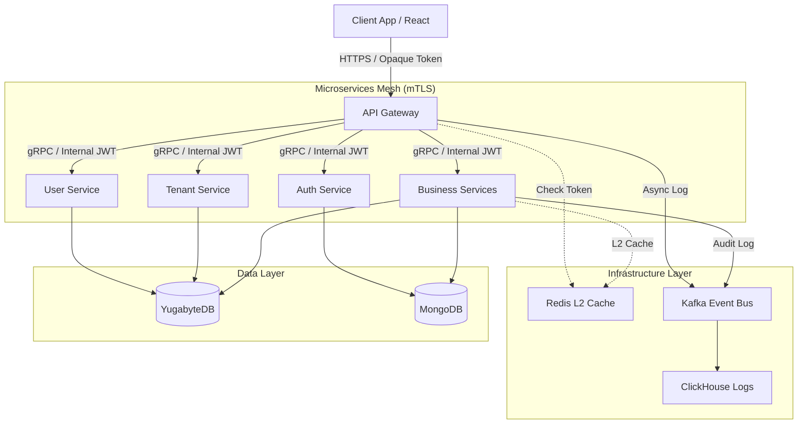

# Architecture Documentation

Technical architecture and design documentation for the High-Performance Go Microservices Framework.

## 📊 Visual Diagrams

For visual learners, we provide Mermaid diagrams showing the system architecture:

- **[System Architecture](diagrams/system-architecture.mmd)** - Polyglot persistence & Microservices
- **[Auth Flow](diagrams/auth-flow.mmd)** - Broker Pattern & Token Exchange
- **[Data Flow](diagrams/data-flow.mmd)** - gRPC, Kafka & CDC

## Table of Contents

- [Architecture Documentation](#architecture-documentation)
  - [📊 Visual Diagrams](#-visual-diagrams)
  - [Table of Contents](#table-of-contents)
  - [Overview](#overview)
    - [Core Principles](#core-principles)
  - [Tech Stack](#tech-stack)
  - [System Architecture](#system-architecture)

---

## Overview

This framework is designed for **High-Performance, Scalability, and Multi-tenancy**. It moves away from a monolithic database approach to a **Polyglot Persistence** architecture, using specific databases for specific types of data. It employs **gRPC** for internal communication, **Kafka** for event-driven consistency, and a **Broker-based Authentication** system.

### Core Principles

1.  **Polyglot Persistence:** Use the right DB for the right job (SQL for ACID, NoSQL for Flex, OLAP for Logs).
2.  **Clean Architecture:** Strict separation of Transport, Service, and Repository layers.
3.  **Security First:** mTLS between services, Phantom Token pattern for clients.
4.  **Performance:** 2-Level Caching (Local + Redis) and gRPC binary protocol.
5.  **Zero-Config Dev:** Developers connect to shared infrastructure for immediate coding.

---

## Tech Stack

| Component         | Technology                  | Purpose                                      |
| :---------------- | :-------------------------- | :------------------------------------------- |
| **Language**      | Go 1.22+                    | Backend Services                             |
| **Communication** | gRPC / gRPC-Gateway         | Internal (High perf) / External (REST)       |
| **ACID DB**       | **YugabyteDB** (PostgreSQL) | Critical Data (Users, Billing, Transactions) |
| **Flex DB**       | **MongoDB**                 | Dynamic Data (Tenant Configs, Catalogs)      |
| **Analytics DB**  | **ClickHouse**              | Audit Logs, Access Logs, Reports             |
| **Caching**       | **Redis / Dragonfly**       | L2 Cache, Pub/Sub                            |
| **Local Cache**   | Ristretto / Go-cache        | L1 In-memory Cache                           |
| **Messaging**     | **Kafka**                   | Event Bus, CDC (Change Data Capture)         |
| **CDC Tool**      | **Debezium**                | Outbox Pattern Implementation                |
| **Observability** | OpenTelemetry               | Tracing & Metrics                            |
| **Frontend**      | React (NextJS)              | Schema-driven UI                             |

---

## System Architecture


    
## Design Philosophy

### 1\. Polyglot Persistence Strategy

We do not force all data into one database.

* **YugabyteDB:** For entities requiring transactions, relations, and strict schema (e.g., `orders`, `invoices`).
* **MongoDB:** For entities requiring schema flexibility or deeply nested documents (e.g., `product_attributes`, `tenant_app_configs`).
* **ClickHouse:** For immutable, high-volume write data (e.g., `logs`, `traces`, `activity_history`).

### 2\. Separation of Concerns \(Clean Architecture\)

Every microservice must follow this folder structure:

```
internal/
├── api/            # gRPC & HTTP Handlers (Transport)
├── service/        # Business Logic (Pure Go, no DB imports)
├── repository/     # Data Access (Yugabyte/Mongo implementations)
├── model/          # Domain Entities
└── platform/       # Shared Lib (Logging, Config, Cache)
```

### 3\. Shared Library \(`go-shared`)

To maintain consistency, all services import `go-shared` for:

* **Middleware:** Auth interceptors, Logging, Tracing.
* **Connectors:** Standardized wrappers for Yugabyte (`pgx`), Redis, Kafka.
* **Utils:** UUID v7 generator, Error handling, encryption.

***

## Database Standards (Cheatsheet)

Strict rules to ensure consistency across Polyglot Databases.

### A. Naming Conventions

* **Snake Case (`snake_case`):** ALL Tables, Columns, Indexes. (Reason: Yugabyte/ClickHouse are case-insensitive).
* **Primary Key:** Always named `_id`. Type: `UUID` (String format).
* **Foreign Key:** `singular_entity_id` (e.g., `tenant_id`, `user_id`).
* **Plural Tables:** `users`, `tenants`, `orders`.

### B. Standard Mixins (Mandatory Fields)

Every table/collection must have these fields:
SQL

```
_id           UUID PRIMARY KEY,
tenant_id     UUID NOT NULL,       -- Multi-tenancy isolation
is_system     BOOLEAN DEFAULT FALSE,
created_at    TIMESTAMPTZ DEFAULT NOW(),
updated_at    TIMESTAMPTZ DEFAULT NOW(),
created_by    UUID,
updated_by    UUID,
deleted_at    TIMESTAMPTZ NULL,    -- Soft Delete
version       BIGINT DEFAULT 1     -- Optimistic Locking
```

### C. Data Type Mapping

| **Data Type** | **Go**            | **YugabyteDB**  | **MongoDB**  | **ClickHouse**  |
| ------------- | ----------------- | --------------- | ------------ | --------------- |
| **ID**        | `string`          | `UUID`          | `String`     | `UUID`          |
| **Money**     | `decimal.Decimal` | `NUMERIC(19,4)` | `Decimal128` | `Decimal128(4)` |
| **Time**      | `time.Time`       | `TIMESTAMPTZ`   | `Date`       | `DateTime64(3)` |
| **JSON**      | `struct/map`      | `JSONB`         | `Object`     | `String`        |
| **Enum**      | `string`          | `VARCHAR`       | `String`     | `Enum8`         |

***

## Detailed Service Architecture

### 1\. API Gateway \(The Entry Point\)

* **Role:** Route traffic, Enforce Security, Protocol Conversion.
* **Tech:** Custom Go Service (using `grpc-gateway`).
* **Routing Logic:**
    * `/api/{service-name}/v1/{api-name}` -> gRPC to Backend Service. Example: /api/user-service/v1/users.
    * `/page/{service-name}/{page-name}` -> Redirect to React Frontend. Example: /api/user-service/users
    * `/upload/*` -> File Service.
    * Other is rewrite URL (slug).

$$note
- service-name is folder name of microservice that omited prefix. Example: go-user-service/react-user-service => user-service
$$

* **Middleware Pipeline:**
    1. **Trace ID:** Generate/Propagate Correlation ID.
    2. **Auth Interceptor:** Phantom Token Validation (See Auth Section).
    3. **Rate Limiter:** Redis-based sliding window.
    4. **Response Caching:** Cache generic GET requests.

### 2\. Auth Service \(The Broker\)

* **Pattern:** Broker & Strategy Pattern.
* **Functions:**
    * **Multi-tenant Config:** Fetches login rules from MongoDB `tenant_configs` (e.g., "Tenant A allows Zalo", "Tenant B allows Google").
    * **Strategies:** Pluggable logic for Password, OTP, Social (Zalo/FB), SSO (OIDC).
    * **MFA:** Handles 2-Factor Authentication state machine.
    * **Token Issuance:** Exchanges Identity Profile for Opaque Token.

### 3\. Business Services \(User\, Tenant\, Product\.\.\.\)

* **Communication:** Receive gRPC calls.
* **Context:** Extract `X-Tenant-ID` and `Internal-Token` from gRPC Metadata.
* **Data Access:** Use `BaseRepository` from `go-shared` to automatically handle Audit, Soft-Delete, and Tenant Filtering.
* **Async Events:** Write to "Outbox" table or publish to Kafka for audit logs.

***

## Authentication & Security

We use the **Phantom Token Pattern** to keep internal data structure hidden from clients.

### 1\. The Token Flow

1. **Client Login:** Sends credentials to Auth Service.
2. **Verification:** Auth Service verifies credentials + MFA.
3. **Creation:**
    * Generates an **Opaque Token** (Random String: `ga-8s7d...`).
    * Generates an **Internal JWT** containing: `sub`, `tenant_id`, `permissions`, `roles`, `correlation_id`.
4. **Storage:** Stores `Opaque Token` -> `Internal JWT` mapping in **Redis** (L2 Cache).
5. **Response:** Returns only the `Opaque Token` to Client.

### 2\. Request Processing

1. **Client Request:** Sends `Authorization: Bearer <Opaque-Token>`.
2. **Gateway Lookup:** Checks Redis for the Opaque Token.
3. **Token Exchange:** Retrieves the Internal JWT.
4. **Forwarding:**
    * Gateway creates a gRPC Metadata context.
    * Injects `Authorization: <Internal-JWT>`.
    * Injects `X-Tenant-ID: <tid>`.
    * Forwards to Microservice via mTLS.
5. **Service Auth:** Microservice validates JWT signature (locally) and checks permissions in JWT claims.

***

## Caching Strategy (2-Level)

To achieve micro-second latency and reduce DB load.

### Level 1: Local Cache (In-Memory)

* **Tech:** Ristretto or ARC (Adaptive Replacement Cache).
* **Scope:** Per Service Instance.
* **Usage:** Immutable config, Hot data.
* **Invalidation:** Short TTL (e.g., 5-30 seconds) or Pub/Sub event.

### Level 2: Distributed Cache

* **Tech:** Redis (or Dragonfly).
* **Scope:** Shared across all instances.
* **Usage:** User Sessions, Shared Query Results.
* **Flow:**
    Go

    ```
    // Pseudo-code in go-shared
    func Get(key) {
        if val, ok := L1.Get(key); ok { return val } // ~0.1ms
        if val, ok := L2.Get(key); ok { 
            L1.Set(key, val)
            return val 
        } // ~2ms
        val := DB.Query() // ~50ms
        L2.Set(key, val)
        L1.Set(key, val)
        return val
    }
    
    ```

***

## Logging & Observability

### Three Pillars

1. **Logs (ClickHouse):**
    * **Access Logs:** Captured by Gateway (Method, Path, Latency, Status).
    * **Audit Logs:** Captured by Services (Who changed what, Old Value, New Value).
    * **Transport:** Kafka Async Writer (Non-blocking).
2. **Metrics (Prometheus):**
    * Expose `/metrics` endpoint.
    * Monitor: Go Runtime, DB Connection Pool, Request Latency.
3. **Traces (Jaeger/Tempo):**
    * OpenTelemetry integration.
    * `TraceID` passed via HTTP Headers / gRPC Metadata.

***

## Development Workflow (Zero-Config)

We prioritize developer velocity. You don't need to run 10 databases locally.

### 1\. The `.env.local` Strategy

* Every service repository comes with a `.env.local` template.
* This file points to a **Shared Development Infrastructure** (Dev Cluster) containing:
    * YugabyteDB Dev Instance
    * Redis Dev Instance
    * Kafka Dev Cluster
    * ClickHouse Dev Instance
* **Benefit:** Developer runs `make run` and connects immediately. No `docker-compose up` waiting time for infra.

### 2\. Handling Race Conditions

Since we share Dev DBs:

* **Redis:** Keys are namespaced: `{tenant}:{env}:{developer}:{key}`.
* **Kafka:** Developers use unique `Consumer Group IDs` (e.g., `order-service-dev-john`).
* **DB:** Developers use specific Test Tenants or separate Schemas if doing migration work.

### 3\. Standard Makefile Commands

Makefile

```
make init      # Copy .env.local, install deps
make gen       # Generate Proto, Swagger, Wire (DI)
make run       # Run service connecting to Shared Infra
make docker    # Build local docker image
make test      # Run Unit Tests (Mocked DB)
make contract  # Run Contract Tests against Gateway
```

**Last Updated:** 2026-01-12
**Architecture Version:** 2.0 (Polyglot/gRPC)