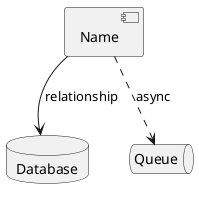
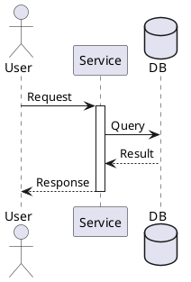
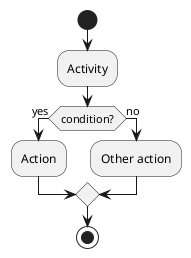

# System Architecture Diagrams

This directory contains PlantUML diagrams for visualizing the go-devtools system architecture and workflows.

## 📊 Available Diagrams

### 1. System Architecture (`system-architecture.puml`)
Complete overview of the microservices architecture including:
- API Gateway layer
- 6 microservices (Auth, User, Tenant, Notification, System Config)
- Data layer (MongoDB, Redis, RabbitMQ)
- Observability stack (Prometheus, Grafana, Jaeger)
- Service connections and data flows

### 2. Installation Flow (`installation-flow.puml`)
Step-by-step visualization of the development environment setup process:
- System detection and prerequisites check
- Workspace setup
- Dependencies installation
- Repository cloning
- Environment configuration
- Service startup and verification

### 3. Data Flow (`data-flow.puml`)
Detailed sequence diagram showing request/response flow:
- User login authentication flow
- Database queries and caching
- Session management
- Event publishing to message queue
- JWT token generation

## 🎨 Viewing the Diagrams

### Option 1: Online PlantUML Editor

1. Visit [PlantUML Web Server](http://www.plantuml.com/plantuml/uml/)
2. Copy and paste the content of any `.puml` file
3. View the rendered diagram

### Option 2: VS Code Extension

1. Install the **PlantUML** extension by jebbs
2. Open any `.puml` file
3. Press `Alt+D` (or `Option+D` on Mac) to preview

### Option 3: Command Line

Install PlantUML locally:

```bash
# macOS
brew install plantuml

# Ubuntu/Debian
sudo apt-get install plantuml

# Using npm
npm install -g node-plantuml
```

Generate PNG images:

```bash
# Generate all diagrams
plantuml docs/diagrams/*.puml

# Generate specific diagram
plantuml docs/diagrams/system-architecture.puml

# Generate SVG (scalable)
plantuml -tsvg docs/diagrams/system-architecture.puml

# Generate with dark theme
plantuml -darkmode docs/diagrams/*.puml
```

### Option 4: Docker

```bash
# Generate all diagrams using Docker
docker run --rm -v $(pwd):/data plantuml/plantuml:latest \
  /data/docs/diagrams/*.puml

# View generated images
open docs/diagrams/*.png  # macOS
xdg-open docs/diagrams/*.png  # Linux
```

## 📁 Generated Files

After running PlantUML, you'll get:

```
docs/diagrams/
├── system-architecture.puml
├── system-architecture.png      (generated)
├── installation-flow.puml
├── installation-flow.png        (generated)
├── data-flow.puml
└── data-flow.png                (generated)
```

**Note:** Generated `.png` and `.svg` files are git-ignored to keep the repository clean.

## 🎯 Use Cases

### For Developers
- **Understanding the system**: Study system-architecture.puml to understand service interactions
- **Onboarding**: Follow installation-flow.puml for setup guidance
- **Debugging**: Use data-flow.puml to trace request paths

### For Documentation
- **README files**: Embed generated PNG images
- **Presentations**: Export as SVG for high-quality slides
- **Architecture reviews**: Share diagrams with team

### For CI/CD
Generate diagrams automatically in your pipeline:

```yaml
# .github/workflows/docs.yml
- name: Generate diagrams
  run: |
    sudo apt-get install -y plantuml
    plantuml docs/diagrams/*.puml
    
- name: Upload diagrams
  uses: actions/upload-artifact@v3
  with:
    name: diagrams
    path: docs/diagrams/*.png
```

## 🔧 Customization

### Themes

PlantUML supports various themes:

```plantuml
@startuml
!theme plain          ' Default clean theme
!theme bluegray       ' Blue-gray theme
!theme black-knight   ' Dark theme
!theme mars           ' Mars theme
@enduml
```

### Colors

Customize colors in the diagrams:

```plantuml
!define PRIMARY_COLOR #4A90E2
!define SECONDARY_COLOR #50C878

component "API Gateway" as gateway #PRIMARY_COLOR
```

### Export Formats

PlantUML supports multiple output formats:

```bash
plantuml -tpng diagram.puml    # PNG (default)
plantuml -tsvg diagram.puml    # SVG (scalable)
plantuml -teps diagram.puml    # EPS (vector)
plantuml -tpdf diagram.puml    # PDF
plantuml -tlatex diagram.puml  # LaTeX
```

## 📖 PlantUML Syntax Reference

### Component Diagrams



### Sequence Diagrams



### Activity Diagrams



## 🔗 Resources

- [PlantUML Official Site](https://plantuml.com/)
- [PlantUML Language Reference](https://plantuml.com/guide)
- [Real World PlantUML](https://real-world-plantuml.com/)
- [PlantUML Cheat Sheet](https://ogom.github.io/draw_uml/plantuml/)

## 🤝 Contributing

When adding new diagrams:

1. Use descriptive filenames (e.g., `service-deployment.puml`)
2. Add comments explaining complex parts
3. Use consistent color scheme
4. Update this README with diagram description
5. Test rendering before committing

Example:

```plantuml
@startuml service-deployment
!theme plain

' This diagram shows the deployment process
' for microservices to Kubernetes

...
@enduml
```



## 📝 Tips

1. **Keep diagrams simple**: Complex diagrams are hard to maintain
2. **Use notes**: Add explanatory notes for clarity
3. **Group related elements**: Use packages/rectangles for grouping
4. **Consistent naming**: Match service names with actual code
5. **Version control**: Commit `.puml` files, not generated images
6. **Auto-generate**: Set up CI/CD to generate images automatically

## ❓ Troubleshooting

### PlantUML not rendering?

```bash
# Check PlantUML installation
plantuml -version

# Verify Java is installed (required)
java -version

# Test with simple diagram
echo "@startuml
Bob -> Alice : hello
@enduml" | plantuml -pipe > test.png
```

### Syntax errors?

Use the online editor to validate syntax:
http://www.plantuml.com/plantuml/uml/

### Images too large?

```bash
# Scale down the output
plantuml -scale 0.5 diagram.puml
```

---

**Last Updated:** 2024-12-25
