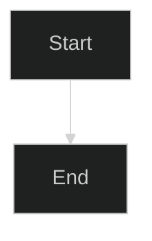
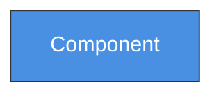
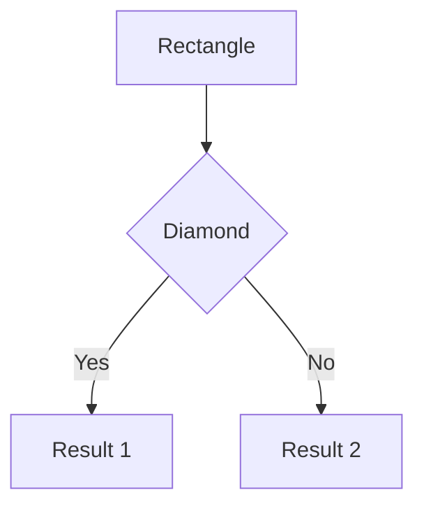
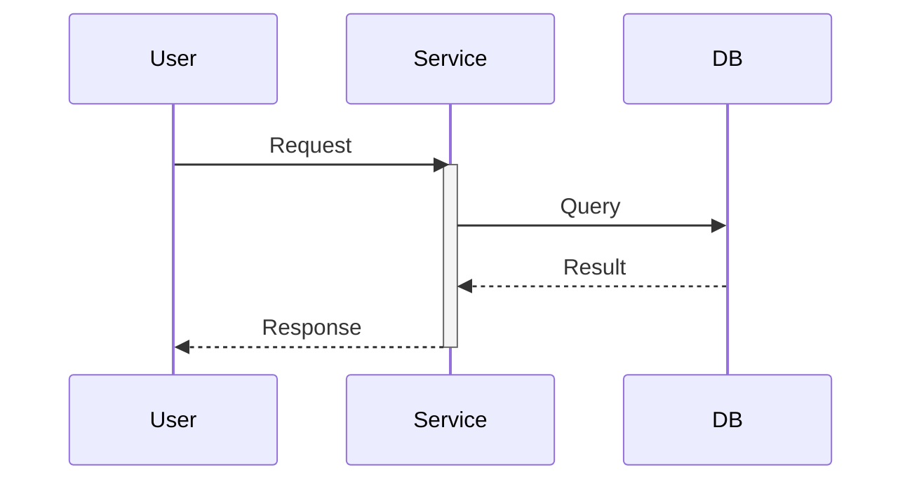
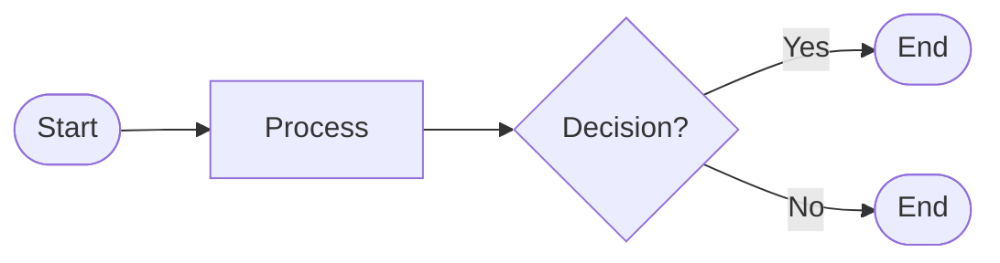
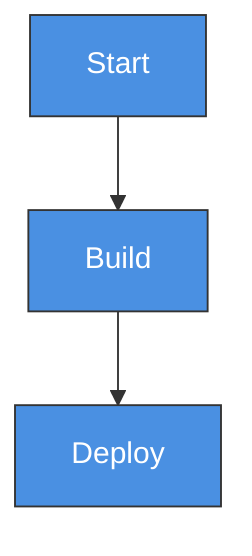
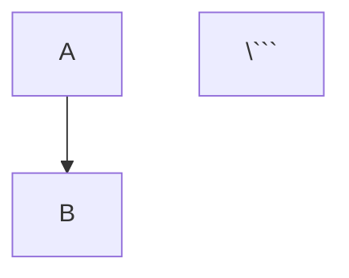

# System Architecture Diagrams

This directory contains Mermaid diagrams for visualizing the go-framework system architecture and workflows.

> **Note:** These diagrams were converted from PlantUML to Mermaid format on 2024-12-30 to provide better integration with GitHub, GitLab, and modern documentation tools that natively support Mermaid rendering.

## 📊 Available Diagrams

### 1. System Architecture (`system-architecture.mmd`)
Complete overview of the microservices architecture including:
- API Gateway layer
- 6 microservices (Auth, User, Tenant, Notification, System Config)
- Data layer (MongoDB, Redis, RabbitMQ)
- Observability stack (Prometheus, Grafana, Jaeger)
- Service connections and data flows

### 2. Installation Flow (`installation-flow.mmd`)
Step-by-step visualization of the development environment setup process:
- System detection and prerequisites check
- Workspace setup
- Dependencies installation
- Repository cloning
- Environment configuration
- Service startup and verification

### 3. Data Flow (`data-flow.mmd`)
Detailed sequence diagram showing request/response flow:
- User login authentication flow
- Database queries and caching
- Session management
- Event publishing to message queue
- JWT token generation

### 4. Developer Workflow (`developer-workflow.mmd`)
Comprehensive activity diagram showing the daily developer workflow:
- Initial setup phase (one-time)
- Daily development cycle
- Development iteration loop with hot-reload
- Integration testing phase
- Monitoring and debugging with observability tools
- Deployment to local Kubernetes and dev environments
- Daily cleanup procedures
- Common utility commands reference

### 5. Component Relationships (`component-relationships.mmd`)
Component diagram illustrating relationships between all go-framework components:
- Core tools (Makefile, CLI)
- Shell script categories (setup, dev, database, testing, build, deployment, monitoring, utilities)
- Configuration and data files
- Documentation structure
- External dependencies (Docker, Kubernetes, Service repos)
- How all components interact with each other

### 6. CI/CD Process (`cicd-process.mmd`)
Detailed sequence diagram of the complete CI/CD pipeline:
- Development and local testing phase
- Code quality checks (linting, static analysis)
- Build phase with multi-service compilation
- Testing phase (unit, integration, coverage, security)
- Docker image build and security scanning
- Deployment to development environment
- Staged deployment to production (staging → approval → production)
- Canary and blue-green deployment strategies
- Post-deployment monitoring and rollback procedures

## 🎨 Viewing the Diagrams

### Option 1: GitHub Native Rendering

Mermaid diagrams are natively supported by GitHub, GitLab, and many documentation platforms. Simply view the `.mmd` files directly on GitHub, and they will be automatically rendered.

### Option 2: VS Code Extension

1. Install the **Markdown Preview Mermaid Support** extension by Matt Bierner
2. Open any markdown file that includes Mermaid diagrams or open a `.mmd` file
3. Press `Ctrl+Shift+V` (or `Cmd+Shift+V` on Mac) to preview

### Option 3: Mermaid Live Editor

1. Visit [Mermaid Live Editor](https://mermaid.live/)
2. Copy and paste the content of any `.mmd` file
3. View and export the rendered diagram (PNG, SVG, or PDF)

### Option 4: Command Line

Install Mermaid CLI locally:

```bash
# Using npm
npm install -g @mermaid-js/mermaid-cli

# Generate PNG images
mmdc -i docs/diagrams/system-architecture.mmd -o docs/diagrams/system-architecture.png

# Generate all diagrams
for file in docs/diagrams/*.mmd; do
  mmdc -i "$file" -o "${file%.mmd}.png"
done

# Generate SVG (scalable)
mmdc -i docs/diagrams/system-architecture.mmd -o docs/diagrams/system-architecture.svg

# Generate with dark theme
mmdc -i docs/diagrams/system-architecture.mmd -o docs/diagrams/system-architecture.png -t dark
```

### Option 5: Docker

```bash
# Generate all diagrams using Docker
docker run --rm -v $(pwd):/data minlag/mermaid-cli \
  -i /data/docs/diagrams/system-architecture.mmd \
  -o /data/docs/diagrams/system-architecture.png

# View generated images
open docs/diagrams/*.png  # macOS
xdg-open docs/diagrams/*.png  # Linux
```

## 📁 Generated Files

After running Mermaid CLI, you'll get:

```
docs/diagrams/
├── system-architecture.mmd
├── system-architecture.png      (generated)
├── installation-flow.mmd
├── installation-flow.png        (generated)
├── data-flow.mmd
└── data-flow.png                (generated)
```

**Note:** Generated `.png` and `.svg` files are git-ignored to keep the repository clean. The source `.mmd` files are the source of truth.

## 🎯 Use Cases

### For Developers
- **Understanding the system**: Study system-architecture.mmd to understand service interactions
- **Onboarding**: Follow installation-flow.mmd for setup guidance
- **Debugging**: Use data-flow.mmd to trace request paths

### For Documentation
- **README files**: Embed generated PNG images
- **Presentations**: Export as SVG for high-quality slides
- **Architecture reviews**: Share diagrams with team

### For CI/CD
Generate diagrams automatically in your pipeline:

```yaml
# .github/workflows/docs.yml
- name: Generate diagrams
  run: |
    npm install -g @mermaid-js/mermaid-cli
    for file in docs/diagrams/*.mmd; do
      mmdc -i "$file" -o "${file%.mmd}.png"
    done
    
- name: Upload diagrams
  uses: actions/upload-artifact@v3
  with:
    name: diagrams
    path: docs/diagrams/*.png
```

## 🔧 Customization

### Themes

Mermaid supports various themes via the `%%init%%` directive:



Available themes: `default`, `neutral`, `dark`, `forest`, `base`

### Colors

Customize colors in the diagrams using classDef:



### Export Formats

Mermaid CLI supports multiple output formats:

```bash
mmdc -i diagram.mmd -o diagram.png    # PNG (default)
mmdc -i diagram.mmd -o diagram.svg    # SVG (scalable)
mmdc -i diagram.mmd -o diagram.pdf    # PDF
```

## 📖 Mermaid Syntax Reference

### Graph/Flowchart Diagrams



### Sequence Diagrams



### Flowchart Diagrams



## 🔗 Resources

- [Mermaid Official Site](https://mermaid.js.org/)
- [Mermaid Live Editor](https://mermaid.live/)
- [Mermaid Syntax Documentation](https://mermaid.js.org/intro/)
- [Mermaid CLI Documentation](https://github.com/mermaid-js/mermaid-cli)
- [GitHub Mermaid Support](https://github.blog/2022-02-14-include-diagrams-markdown-files-mermaid/)

## 🤝 Contributing

When adding new diagrams:

1. Use descriptive filenames (e.g., `service-deployment.mmd`)
2. Add comments explaining complex parts using `%%` for single-line or `%% comment %%` for inline
3. Use consistent color scheme with classDef
4. Update this README with diagram description
5. Test rendering before committing (use Mermaid Live Editor or VS Code preview)

Example:



## 📝 Tips

1. **Keep diagrams simple**: Complex diagrams are hard to maintain
2. **Use comments**: Add explanatory comments with `%%` for clarity
3. **Group related elements**: Use subgraphs for grouping
4. **Consistent naming**: Match service names with actual code
5. **Version control**: Commit `.mmd` files, not generated images
6. **Auto-generate**: Set up CI/CD to generate images automatically
7. **Native rendering**: GitHub and GitLab render `.mmd` files automatically in markdown

## ❓ Troubleshooting

### Mermaid not rendering?

```bash
# Check Mermaid CLI installation
mmdc --version

# Test with simple diagram
echo "graph TD; A-->B" > test.mmd
mmdc -i test.mmd -o test.png
```

### Syntax errors?

Use the Mermaid Live Editor to validate syntax:
https://mermaid.live/

### Images too large?

```bash
# Scale down the output
mmdc -i diagram.mmd -o diagram.png -w 800

# Or specify scale factor
mmdc -i diagram.mmd -o diagram.png -s 2
```

### GitHub not rendering?

Ensure your `.mmd` files are referenced correctly in markdown:

```markdown
# Correct way to embed in markdown


Or link to the file:
```markdown
[View Diagram](./path/to/diagram.mmd)
```

---

**Last Updated:** 2024-12-30  
**Conversion Note:** All diagrams were converted from PlantUML to Mermaid format to leverage native GitHub/GitLab rendering and better integration with modern documentation tools. Original PlantUML files have been replaced with Mermaid equivalents (.mmd files).
